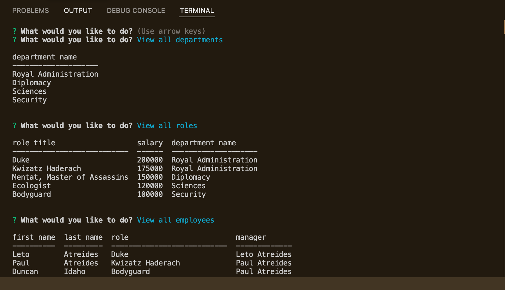

# Employee Manager

  
   
   
  
  A simple application run entirely in the command line that connects to a lightweight local database. Built using NodeJS and MySQL.
   
   

  ##### Table of Contents  
  [How to Install](#installation)  
  [Usage](#usage)   
  [How to Contribute](#contribution)  
  [Contact](#contact)  
   

  
    
   

  

  ## How to Install
  Clone the repo from GitHub, open the root directory in a terminal window, and run "npm i
   
   

  

  ## Usage
  Make sure you have run "npm i" in the root directory. Also make sure to login to mySQL in the root directory and source the schema and seeds files. This will ensure your database is setup with some starter data.
   
   

  [Video Walkthrough](https://youtu.be/Mex0mJOMmE8)

  

  ## How to Contribute
  Ask to be added as a collaborator, and then submit a pull request with any contributions you wish to make
   
   

  

  ## Contact
  If you have any questions, contact the administrator at:

  * [n-r-martin](github.com/n-r-martin)
  * hello@nickmartin.design
  